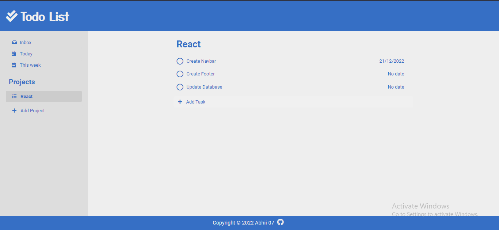

# Simple To-Do List

### This is a simple app for keeping track of your To-Dos for different projects

<!-- 

 -->

**Note:** This website works best with high res screens (1080p and up). Check the [improvements section](#improvements) for future updates.

## Built With 

- Vanilla JS
- HTML5
- CSS3

## Live Demo

[Simple To-Do List:bookmark_tabs:](https://github.com/Abhii-07/Odin/tree/master/Javascript-Course/OOP_Principles/Project_TodoListBasic)

### Usage

##### Once you are on the Home Page, you have two main panels
- **Projects Panel**.- To switch between different Projects
- **To-Do Panel**.- To check or uncheck To-Dos for the selected project

## Improvements

Features we are going to add to this app:
- Bug test and squash some bugs
- Add option to add due time for to-do
- Add functionailty to rearrange projects and to-dos by dragging and dropping
- Approach a Responsive Web Design(RWD)
- Move from HTML and vanilla CSS to React Js framework

## Acknowledgement

Design inspired by [Notion](https://notion.so/)

